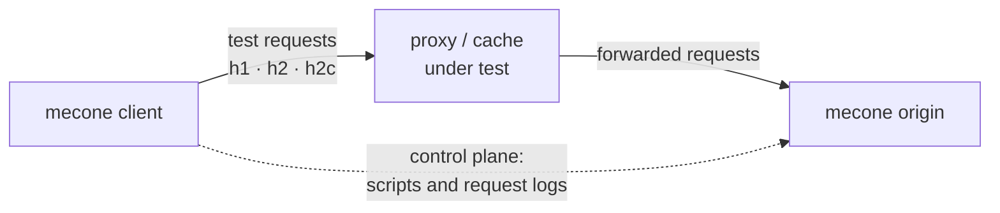

# 

HTTP Protocol Compliance Tester • Pronounced like mě-CŌN-ē / McConey

Mecone measures how closely a reverse proxy or reverse proxy cache follows the HTTP specifications. It runs on **both sides** of the proxy under test: a **client** in front of it and an **origin** behind it. The two halves coordinate, so every test sees the whole exchange — what the client sent and received, *and* what the proxy actually forwarded to the origin — and can then judge and score the proxy.

Mecone is a companion project to [Trickster](https://github.com/trickstercache/trickster), but it works with any HTTP intermediary: CDNs, nginx, Varnish, Envoy, HAProxy, Apache Traffic Server, and so on.

## Industry Tests

You can run an industry-wide conformance test with a single command, testing Trickster, Nginx, HAProxy, Traefik, Envoy, Varnish, Squid and Apache Traffic Server. It takes under 1 minute (not counting container pulls).

```
make industry-test
```

### State of the Industry Reports

We will run and publish quarterly 'State of the Industry' reports to this space, using the `industry-test` catalog. As Mecone evolves to include more exhaustive test cases, scores will change over time.

* [2026 Q3 State of the Industry Report](./soti/2026-q3-soti.md)


## Why "Mecone"?

Trickster was originally written to accelerate Prometheus, and the Prometheus of Greek myth was a trickster. His most famous trick - dividing a sacrificed ox in two, so that Zeus would choose the bony half dressed up in fat - happened at Mecone. The project icon, an ox head split in two, stands for that origin story and for Mecone's own two halves: client and server.

## How it works



Every test is a short, named scenario, such as *"a response marked `no-store` is never reused"*. Each test runs like this:

1. **Script.** The client gives the test a fresh random ID and uploads the test's *script* — the responses the origin should give — to the origin's control plane.
2. **Exchange.** The client sends the test's requests through the proxy, in order and with any pauses the test calls for. Each request carries its step number.
3. **Record.** When a request reaches the origin, the origin answers with the scripted response for that step and records exactly what it received: method, target, protocol and every header.
4. **Judge.** The client fetches the origin's record and checks each step against the test's expectations. Did the proxy answer from cache or forward the request? Did it add, remove or relay the right fields? Was the response it returned correct?

Each test gets its own ID, and therefore its own URLs, so tests never interfere with one another and run concurrently.

## Features

- **Both legs observed.** Assertions cover what the client received and what the origin received, so Mecone can test forwarding behavior (hop-by-hop fields, `Via`, conditional revalidation) as well as caching.
- **Protocols.** The client speaks HTTP/1.1, HTTP/2 over TLS and h2c toward the proxy. The origin serves HTTP/1.1, h2c and HTTP/2 over TLS, and records which one the proxy used. HTTP/3 is planned.
- **A realistic origin.** By default the origin answers conditional requests with `304` as RFC 9110 prescribes, and can serve byte ranges (`206` and `416`). It can also send 1xx interim responses and trailers, delay a response, or drop the connection.
- **Scored by requirement level.** Each test is tagged `must`, `should`, `may` or `info` after RFC 2119. Mecone reports a pass rate per level and a weighted score, per suite and overall.
- **Declarative tests.** Tests are short YAML files, validated strictly when they load and embedded in the binary. You can load your own with `-suites-dir`.
- **Built for CI.** A run prints only a score table per target; the per-test findings go to the JSON, YAML, CSV and Markdown files you name. You can compare a run against a baseline and set a minimum `must` pass rate as a CI gate.

## Quick start

Build the binary into `bin/`:

```bash
make build
```

Try the harness with no proxy at all. `run` starts an origin in-process and points the client straight at it:

```bash
bin/mecone run
```

To test a real proxy:

1. Start an origin somewhere the proxy can reach:

   ```bash
   bin/mecone origin -listen :8000
   ```

2. Configure the proxy under test to use `http://<origin-host>:8000` as its upstream for all paths, or at least for `/t/` (test traffic) and `/_mecone/` (control traffic).

3. Run the client against the proxy. Pass `-control` when the client can reach the origin directly. Otherwise control traffic goes through the proxy, marked `Cache-Control: no-store`.

   ```bash
   bin/mecone client -target http://proxy:8080 -control http://origin-host:8000 -proto h1,h2c -json results.json -yaml results.yaml
   ```

4. Render or compare the results:

   ```bash
   bin/mecone report -baseline previous.json results.json
   ```

`bin/mecone run -listen :8000 -target http://proxy:8080` does steps 1 and 3 in one process, when the proxy's upstream is this machine's port 8000.

## Testing a catalog of proxies

`run` and `client` take a `-config` file. When that file names targets, Mecone tests all of them in one invocation. For each target it starts an origin on a port of its own, starts the proxy — a docker container or a local command — waits until a request actually travels client → proxy → origin, runs the suites through it, and shuts the proxy down.

```yaml
targets:
  - name: nginx
    docker:
      image: nginx
      tag: "1.30.4-alpine"
      files:
        - source: conf/nginx.conf         # ${LISTEN_PORT} and ${ORIGIN_URL} are filled in
          target: /etc/nginx/nginx.conf
```

```bash
bin/mecone run -config catalog.yaml -json results.json -yaml results.yaml
```

What comes out is one report covering every target: a table of targets, then a section per target, and results JSON or YAML with one run per target. Because each target has its own origin, runs never share cache state or test IDs. A proxy that never starts is recorded as a failed run with the reason rather than ending the report, and the command exits non-zero once the report is written. `report -min-must` then holds every target to the bar separately.

A configuration file with no targets only supplies defaults for the flags, and a flag you actually type always wins. See [docs/configuration.md](docs/configuration.md) for every field.

`catalogs/industry-wide/` holds a catalog of well-known open-source proxies, each pinned to a released image with a configuration that points it at its own Mecone origin. `make industry-test` runs it and writes a timestamped `report-<time>.yaml`, `report-<time>.csv` and `report-<time>.md` into `catalogs/industry-wide/reports/<YYYY-MM-DD-hhmmss>/`; those report files are gitignored.

`catalogs/selftest/` points the client at Mecone's own origin, so the "proxy" under test is the origin itself. It measures no proxy; it exercises the harness end to end and pins what the suites do with no intermediary in the path. `make selftest` runs it.

`catalogs/trickster-baseline/` measures Trickster against itself: the newest release in docker, and whatever Trickster is running on this machine. `make trickster-test` runs it the same way. The local instance is not started or configured by Mecone, so the catalog file says what it expects of it.

### Timings and CSV output

Every request records what it cost the client: time to first byte, total time, whether the connection was reused, and bytes read. These are reported only — no outcome, pass rate or score depends on them. `-csv` writes one row per request, across every target, for analysis elsewhere:

```bash
bin/mecone run -config catalog.yaml -json results.json -yaml results.yaml -csv rows.csv
bin/mecone report -csv rows.csv results.json     # the same rows, from a saved results file
```

### What goes where

While a run is in progress, only progress lines and genuine errors go to **stderr**. Nothing about an individual test is printed. When the run finishes, **stdout** gets the scores and nothing else — a table of targets when there is more than one, then a score table per target:

```text
Target  Score  MUST           SHOULD       MAY           Inconclusive  Skipped  Errors
envoy   85     40/46 (87.0%)  2/3 (66.7%)  7/16 (43.8%)  0             8        0
nginx   61     29/46 (63.0%)  1/3 (33.3%)  4/16 (25.0%)  0             8        0

envoy
- Client protocols: h1

Suite         Score  MUST            SHOULD        MAY           Inconclusive  Skipped  Errors
overall       85     40/46 (87.0%)   2/3 (66.7%)   7/16 (43.8%)  0             8        0
caching       90     28/30 (93.3%)   1/2 (50.0%)   4/9 (44.4%)   0             3        0
ranges        100    6/6 (100.0%)    -             3/3 (100.0%)  0             0        0
```

Which test passed or failed, and why, goes to the files you name. Each flag is named for the extension it writes: `-json` or `-yaml` for the full results, `-csv` for the request rows, `-md` for the rendered report with its findings.
RFC references are retained in the JSON and YAML results, written to the CSV `refs` column, and linked from each Markdown finding.

```bash
bin/mecone run -config catalog.yaml -json results.json -yaml results.yaml -csv rows.csv -md report.md
bin/mecone report -baseline previous.json -md report.md results.json
```

`-md` always writes Markdown. `-format` changes only what stdout gets: `text` (the default for `run` and `client`), `md` or `json`. `mecone report` defaults to `md`, since rendering a saved results file is its whole job.

## Commands

| Command | Purpose |
|---|---|
| `mecone origin` | Run the origin role behind the proxy under test |
| `mecone client` | Run tests through the proxy under test against a remote origin, or a `-config` catalog |
| `mecone run` | Run an origin and the client together in one process, or a `-config` catalog |
| `mecone list` | List the available tests, filtered by suite, ID pattern or level |
| `mecone report` | Score a results file, compare it to a baseline, enforce `-min-must` |
| `mecone version` | Print version information |

Run `mecone <command> -h` for each command's flags.

## Built-in suites

| Suite | Covers |
|---|---|
| `caching` | Storing, reusing, validating and invalidating responses in a shared cache, including `Vary`, cache directives and stale serving (RFC 9111, RFC 5861, RFC 8246) |
| `ranges` | Byte ranges and partial content, including ranges from stored responses (RFC 9110 §14) |
| `intermediary` | What a proxy must add, remove or relay when it forwards messages (RFC 9110 §5.3, §7.6, §15.2) |
| `cache-status` | How a cache reports its own handling of a request (RFC 9211) |
| `targeted` | Cache-control fields addressed to one kind of cache, such as `CDN-Cache-Control` (RFC 9213) |
| `semantics` | Observable HTTP message semantics and valid-message framing across HTTP/1.1 and HTTP/2 (RFC 9110, RFC 9112, RFC 9113) |

Planned suites include request collapsing, malformed HTTP/2 frame handling, and HTTP/3.

## Writing tests

A test is a named list of steps, plus the responses the origin gives:

```yaml
- id: storage-no-store
  title: A response marked no-store is never reused
  level: must
  refs: [RFC9111#5.2.2.5]
  responses:
    no-store:
      headers: ["Cache-Control: no-store"]
      body: never reuse me
  steps:
    - arrange: true
      expect: {forwarded: true}
    - expect: {forwarded: true}
```

See [docs/writing-tests.md](docs/writing-tests.md) for the full reference, and [docs/architecture.md](docs/architecture.md) for how the pieces fit together.

## Scoring

| Level | Meaning | Weight |
|---|---|---|
| `must` | An absolute requirement (MUST, MUST NOT, REQUIRED, SHALL) | 10× |
| `should` | A recommendation (SHOULD, SHOULD NOT, RECOMMENDED) | 4× |
| `may` | An optional capability, such as reusing a fresh response | 1× (the baseline) |
| `info` | Observed behavior with no spec judgement | Never scored |

Only passes and failures count. *Inconclusive* results (a setup step did not hold), *skipped* results (not applicable, or a required test did not pass) and harness *errors* are reported separately.

The **score** is the share of weighted requirements met, from 0 to 100. Each level's passes and its total are multiplied by that level's weight before being summed:

```text
score = 100 × (10·must_passed + 4·should_passed + 1·may_passed)
            ÷ (10·must_tested + 4·should_tested + 1·may_tested)
```

A proxy passing 5 of 8 `must`, 2 of 4 `should` and 1 of 5 `may` tests scores `(50 + 8 + 1) / (80 + 16 + 5)`, or **58**. Failing a `must` therefore costs ten times what failing a `may` does, while an optional capability still counts for something. Reports score every suite separately as well as the run as a whole, and show the passed, tested and percentage figures for each level alongside the score. A target with no conclusive results has no score at all, which is not the same as scoring zero.

## Project layout

```text
cmd/mecone/        entry point
pkg/cli/           command-line interface
pkg/config/        configuration file: run defaults, origin settings, target catalog
pkg/protocol/      wire contract shared by client and origin (paths, headers, JSON documents)
pkg/proto/         protocol names (h1, h2, h2c, h3) and client transports
pkg/testdef/       test definition schema and validation
pkg/corpus/        loading, validating and selecting suites
pkg/origin/        origin role: control plane, scripted responses, request log
pkg/client/        client role: scheduling, sending, observing
pkg/check/         judging observations against expectations
pkg/target/        starting and stopping the proxies under test (docker, process)
pkg/orchestrate/   testing a catalog of targets, each with its own origin
pkg/results/       machine-readable run results (JSON and YAML)
pkg/report/        scoring, Markdown and JSON reports, CSV rows
suites/            built-in test suites (YAML, embedded in the binary)
catalogs/          catalogs of proxies to test with -config
docs/              architecture, configuration and test-writing guides
```

## Development

```bash
make build    # tidy modules and build bin/mecone
make test     # run the tests with coverage
make lint     # govulncheck, go fix -diff and golangci-lint
make selftest # run every built-in suite against Mecone's own origin, with no proxy in between
```
