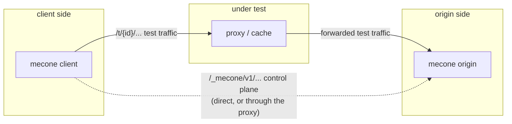
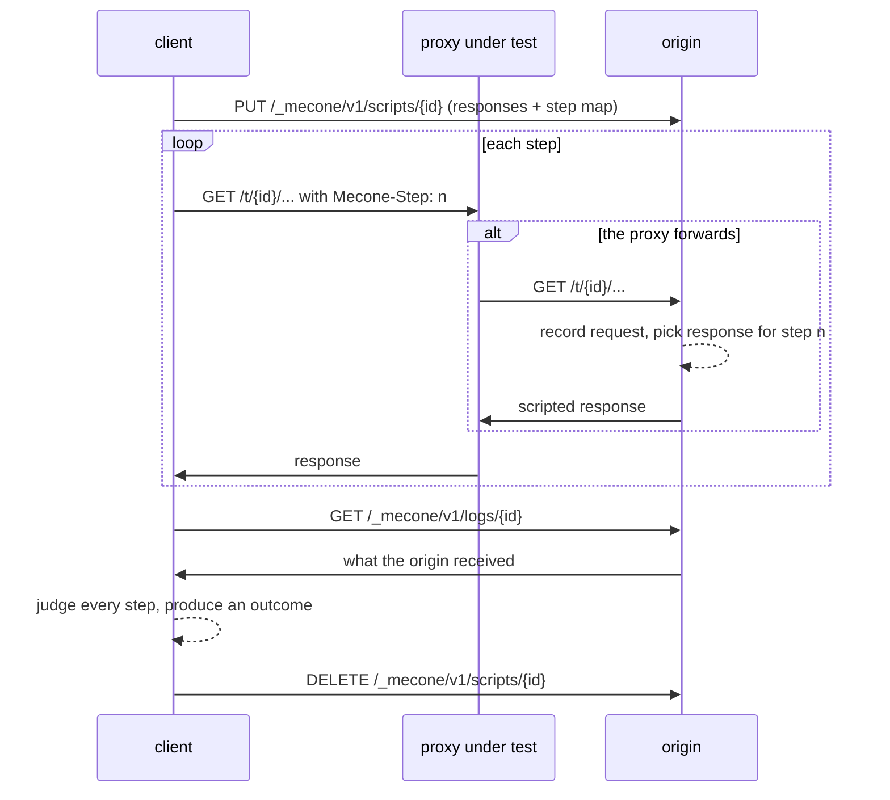
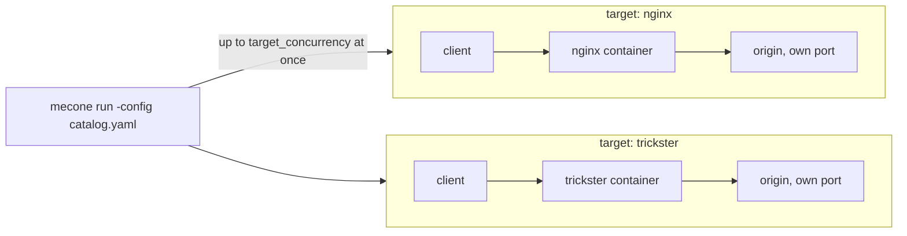

# Mecone architecture

Mecone tests an HTTP intermediary (a reverse proxy, a cache, a CDN edge) by standing on both
sides of it. The **client** sends requests into the proxy under test. The **origin** sits behind
the proxy and answers whatever the proxy forwards. Because Mecone controls both ends, each test
can assert on the two legs of the exchange: what the proxy returned to the client, and what it
sent to the origin.

One binary plays either role, or both at once. Given a catalog of targets, it also starts the
proxies themselves, gives each its own origin, and tests them in a single run.



## Test lifecycle



1. The client creates a random 128-bit **test ID** for each (test, client protocol) pair. All
   of that test's traffic lives under `/t/{id}/`, so its cache keys can't collide with any
   other test's, even when tests run concurrently or are rerun against a warm cache.
2. It uploads the test's **script**: a set of named responses, and which response answers
   each step.
3. It sends each request step through the proxy with a `Mecone-Step` header. Wait steps pause
   the sequence, for example to let a stored response go stale.
4. The origin answers each request that reaches it and appends an entry to the test's
   **request log**. The entry is written before any response bytes are sent, so the log is
   complete by the time the client has a response.
5. The client fetches the log and hands its observations and the log to the **checker**, which
   decides the outcome.

## Control plane

The control plane is versioned JSON over HTTP under `/_mecone/v1/`. Every control response
carries `Cache-Control: no-store`, so it can safely go through the proxy under test when the
client can't reach the origin directly (`client -control` omitted).

| Method and path | Body | Result |
|---|---|---|
| `GET /_mecone/v1/info` | | `Info`: tool name, version, protocol version, listeners |
| `PUT /_mecone/v1/scripts/{id}` | `Script` | `204`; replaces any existing script and log for the ID |
| `DELETE /_mecone/v1/scripts/{id}` | | `204`; removes the script and its log |
| `GET /_mecone/v1/logs/{id}` | | `Log`: the requests the origin received for the ID |

The client refuses an origin whose `Info.Protocol` differs from its own. Any incompatible
change to the documents in `pkg/protocol` must bump `protocol.Version` and the `v1` path
segment. Scripts decode strictly (unknown fields are rejected), so version skew fails loudly.
Abandoned scripts expire after 30 minutes, and each test's log is capped at 1000 entries.

## Wire headers

| Header | Direction | Meaning |
|---|---|---|
| `Mecone-Step` | client → origin | 1-based position of the step in the test. The origin picks its response with it. |
| `Mecone-Response` | origin → client | Name of the scripted response the origin served |
| `Mecone-Origin-Seq` | origin → client | Arrival order of this request among the test's requests |
| `Mecone-Origin-Time` | origin → client | Origin clock when the response was built (Unix ms) |

A request that arrives without a recognized step number is answered with the response of the
test's last request step. This covers requests a proxy makes on its own, such as background
revalidation.

## The origin

The origin (`pkg/origin`) behaves like a well-behaved HTTP server unless a test says otherwise:

- **Conditional requests.** For a `200` response, `If-None-Match` is compared with the
  response's `ETag` using weak comparison, falling back to `If-Modified-Since` against
  `Last-Modified`. A match returns `304`. Set `ignore_conditionals` to always send the full
  response.
- **Ranges.** With `ranges: true`, the response is served through `http.ServeContent`, which
  handles single and multipart ranges, `If-Range`, and `416`. A `Range` field the server must
  ignore — one on a method other than `GET`, or in a range unit other than `bytes` — is dropped
  first, so those requests get the whole representation.
- **Extras.** 1xx interim responses, trailers, a pause before the response (`delay`), and
  aborting the connection (`disconnect`).
- **Dates.** Header values may use `${now}`, `${now+1h}` or `${now-90s}`. These render as
  IMF-fixdate when the response is built.
- **Defaults.** A missing status means `200`, and a missing `Content-Type` means
  `text/plain; charset=utf-8`.

Listeners: cleartext serves HTTP/1.1 and h2c; TLS serves HTTP/1.1 and HTTP/2. The protocol each
request arrived on is logged, so results record which protocol the proxy used upstream.

## The client

The client (`pkg/client`) builds one transport per client protocol (`pkg/proto`). Transports
never follow redirects, never negotiate compression, and ignore proxy environment variables,
so every response the checker sees is exactly what the proxy sent. The client captures 1xx
responses (via `httptrace`), trailers, the negotiated protocol and transport errors. A proxy
that resets a connection fails the test rather than crashing the harness.

**Scheduling.** Every (test, protocol) pair is a job. Jobs run concurrently, bounded by
`-concurrency`. A job with `requires` first waits for the jobs it depends on and only then takes
a concurrency slot, so dependency chains can't deadlock the pool. If a dependency did not pass
on the same protocol, the dependent job is *skipped*: its precondition, such as "this proxy
reuses fresh responses", doesn't hold.

## Judging

`pkg/check` turns observations and the origin log into failures, and failures into one
outcome:

| Outcome | When |
|---|---|
| `pass` | Every expectation held |
| `fail` | An expectation on a non-arrange step did not hold, or a request failed at the transport level |
| `inconclusive` | An expectation on an `arrange` step did not hold, so the scenario never got set up |
| `skipped` | The test doesn't apply over this protocol, or a required test did not pass |
| `error` | The harness failed (control plane unreachable, canceled run); nothing was learned about the proxy |

## Scoring

`pkg/report` computes per-level pass rates over conclusive results only (`pass` and `fail`), then
combines them into a single weighted score:

- `must` counts ten times, `should` four times, and `may` once — the baseline.
- The score is `100 × weighted passes ÷ weighted totals`, truncated to a whole number, so the
  three levels become one figure without any of them being judged in isolation.
- Each suite is scored the same way as the run as a whole, so a weak area stays visible.
- `info` is listed but never scored, and inconclusive, skipped and errored results are reported
  separately rather than counted against the score.
- Nothing conclusive means no score, which reports distinguish from a score of zero.

Reports come in Markdown, JSON, or the plain text score table that `run` and `client` print to
stdout, and can list outcome changes against a baseline run.

## Testing a catalog of targets

A configuration file (`-config`, see [configuration.md](configuration.md)) can name a catalog of
proxies. `run` and `client` then test every one of them, and `pkg/orchestrate` keeps the runs
apart.



**One origin per target.** Each target gets its own origin, listening on its own ephemeral port
for the length of that target's tests. Scripts, request logs and cache state therefore never
cross between targets, and two targets can run the same test, with the same test IDs, at the
same time. The client reaches that origin's control plane directly on loopback, never through
the proxy under test.

**Bounded concurrency.** Targets run concurrently, no more than `target_concurrency` at a time
(default 8). Within a target, tests run at `-concurrency` as usual. Setting
`target_concurrency: 1` trades wall time for quieter timings.

**Catalog order, whatever the schedule.** Each target writes its run into its own slot in a slice
indexed by catalog position, so a target that starts late and finishes first still appears where
the catalog put it. Every renderer — the terminal summary, Markdown, JSON, YAML and CSV — walks that
slice in order, so all five agree.

**Readiness before tests.** `pkg/target` starts the container or process, then polls the target
until it answers — by default fetching `/_mecone/v1/info` *through the proxy*, which proves the
whole client-proxy-origin path works before a single test runs. A test failure therefore means
something about the proxy's behavior, not that the run started too early.

**A failed target is a result, not an abort.** A target that cannot be started, never becomes
ready, or fails part way through is recorded as a run with an `error` and the reason, while the
other targets carry on. Recent output from the container or process is attached to the error.
The report covers every target in catalog order; the command exits non-zero afterwards, so a
lifecycle failure is never mistaken for a pass. `report -min-must` holds each target to the bar
separately, and a target that was never tested fails it.

A report with more than one run leads with a table of targets and then a section per target.
Baseline runs are matched to targets by name, so a catalog run can be compared to an earlier
catalog run.

Lifecycle work lives in `pkg/target`: container and process startup, `${...}` interpolation,
rendering configuration files, readiness polling, and shutdown (a stop command, or `SIGTERM`
then `SIGKILL` to the process group). Shutdown runs on a detached context with a grace period,
so canceling a run still stops what it started.

## Timings and raw request rows

Every request step records what it cost the client: time to first byte, total time through
reading the body, whether the connection was reused, and the bytes read. The client collects
these with `httptrace` as it sends the request it was going to send anyway.

These numbers are **reported only**. Judging and scoring never look at them — no outcome, pass
rate or score depends on a timing — and the only thing that reads them back is the CSV writer.
A proxy is not scored for being fast, and a slow machine does not lower a score. They are there to explain a result — a `total_ms` that
matches a test's `delay` says the response came from the origin — and to watch for drift
between runs.

`-csv` writes one row per request step, across every target in the report, for analysis outside
Mecone:

```text
run_started,target,target_url,client_proto,origin_proto,suite,group,test,level,outcome,
step,method,path,status,forwarded,conn_reused,ttfb_ms,total_ms,bytes,error
```

A result that made no requests still gets one row, and so does a target that could not be tested
(outcome `error`, with the reason). `mecone report -csv` produces the same file from a saved
results JSON, since the timings are kept in the results. `-yaml` writes the same full results
record as `-json`, as YAML.

## Package map

| Package | Role | Depends on |
|---|---|---|
| `pkg/protocol` | Wire contract: paths, headers, `Script`, `Log`, date templates | stdlib |
| `pkg/proto` | Protocol names, scheme rules, client transports | stdlib |
| `pkg/testdef` | Definition schema, validation, conversion to a `Script` | protocol, proto |
| `pkg/corpus` | Strict YAML loading, cross-test validation, selection | testdef |
| `pkg/origin` | Origin role | protocol, proto |
| `pkg/check` | Expectations → failures → outcome | testdef, protocol, results |
| `pkg/client` | Client role | check, protocol, proto, testdef, results |
| `pkg/results` | Run record, JSON and YAML I/O | stdlib |
| `pkg/report` | Weighted scores, reports, baseline diffs, CSV rows | results, testdef |
| `pkg/config` | Configuration file: run defaults, origin settings, target catalog | proto, protocol, testdef |
| `pkg/target` | Starting and stopping proxies, interpolation, readiness | config, protocol |
| `pkg/orchestrate` | A run per target: own origin, concurrency, error attribution | client, config, origin, results, target |
| `pkg/cli` | Commands and flags | everything above |
| `suites` | Built-in YAML suites, embedded | stdlib |

The origin never imports the definition schema. It only understands the `pkg/protocol`
documents, so the test format can change without touching deployed origins.

## Extending Mecone

- **New tests** need only YAML; see [writing-tests.md](writing-tests.md).
- **New expectation kinds** (for example, asserting the forwarded request count, or checking
  multipart bodies) go in `testdef.Expect`, with validation in `testdef` and evaluation in
  `pkg/check`.
- **New origin behaviors** go in `protocol.Response` (a wire change: bump the protocol version
  if it's incompatible), `testdef.Response`, the conversion in `testdef/script.go`, and
  `origin/respond.go`.
- **HTTP/3** needs a QUIC transport in `pkg/proto` and a QUIC listener in `pkg/origin`.
  `proto.H3` is already reserved and returns `proto.ErrUnsupported`.

## Independence

Mecone is licensed under Apache 2.0. Its schema, wire protocol and tests were written directly
from the RFCs. Contributions must not port test definitions, schemas or protocols from other
HTTP test suites.
